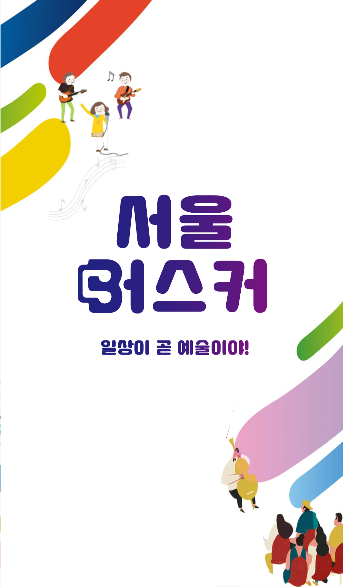
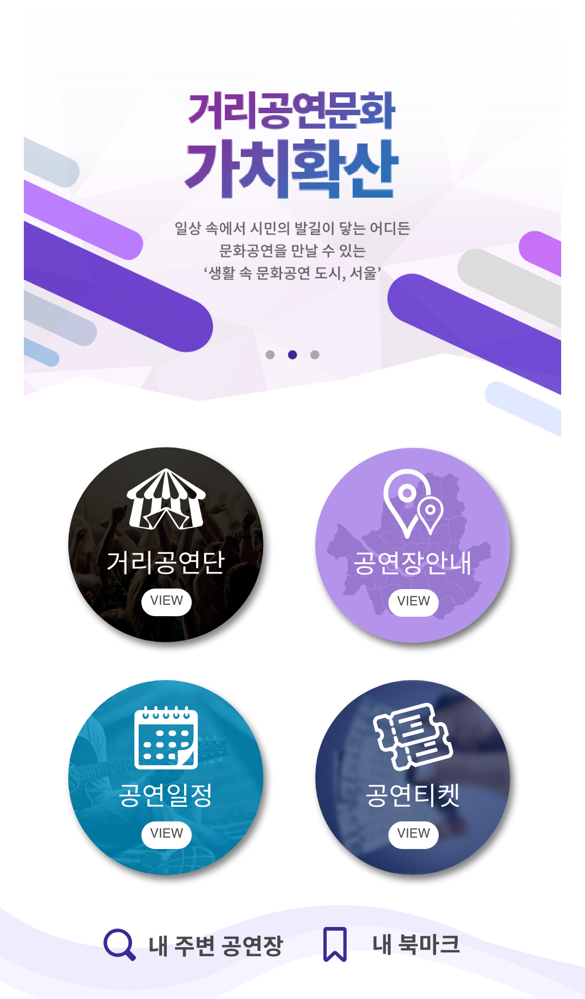
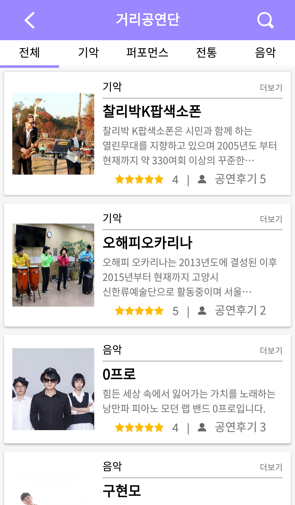
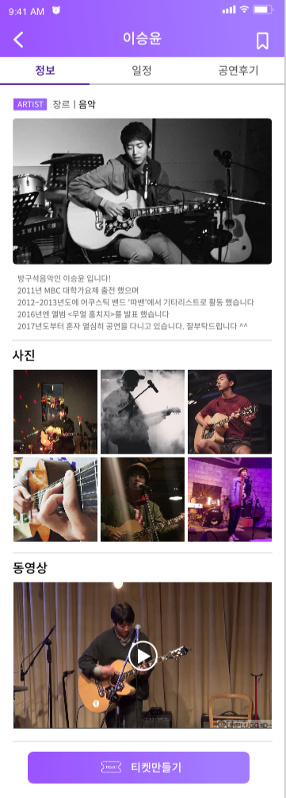
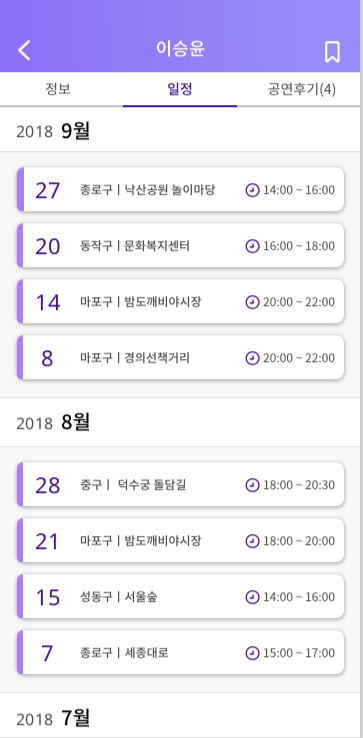
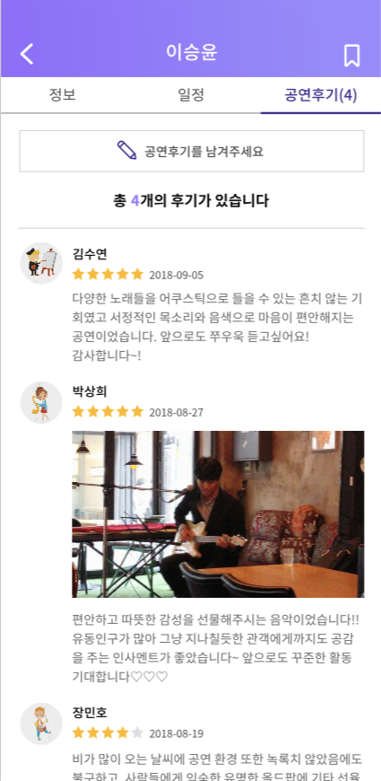

# SeoulBusker
[2018년 서울시 앱 공모전 수상작 - 예선당선작] \
서울 버스커. 서울 거리예술존 활성화와 홍보를 위한 티켓(초대장) 생성과 거리공연 정보제공을 위한 어플리케이션. https://mplatform.seoul.go.kr/w/contest/award/2018/nominee/selectNominee.do

# 앱 소개

         
 

 
__<스플래쉬 화면>__             __<4가지 메뉴의 메인화면>__

 

__<4가지 메뉴의 메인화면>__

 

__<거리 공연단 리스트>__

 
 
  

 __거리 공연단 상세 정보(설명, 사진, 유튜브 영상 제공)__       __거리 공연단 공연 정보__           __거리 공연단 리뷰__
