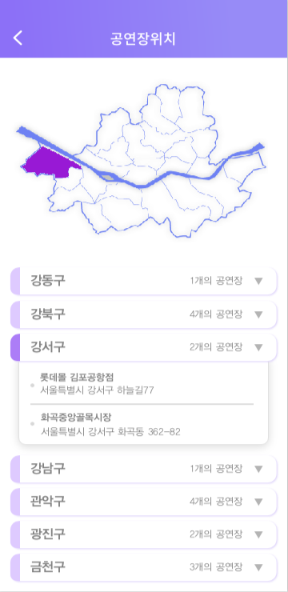
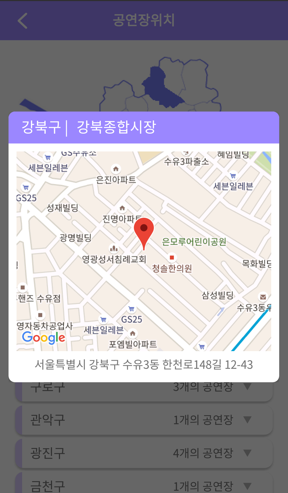
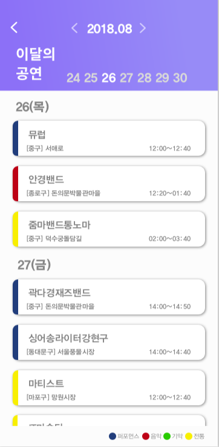
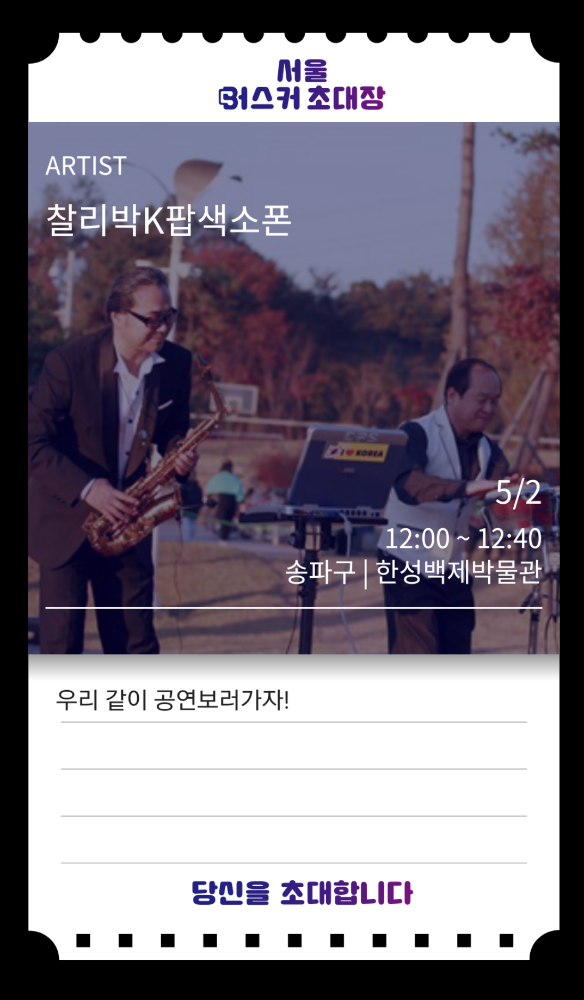

# SeoulBusker
[2018년 서울시 앱 공모전 수상작 - 예선당선작] \
서울 버스커. 서울 거리예술존 활성화와 홍보를 위한 티켓(초대장) 생성과 거리공연 정보제공을 위한 어플리케이션. https://mplatform.seoul.go.kr/w/contest/award/2018/nominee/selectPageListNominee.do

# 기능 간략 소개
1. 거리 공연단 : 거리 공연단 리스트 및 상세보기에서 정보, 공연일정, 리뷰 제공
2. 공연장 안내 : 공연장 리스트 보기 및 구글 맵으로 위치 확인 
3. 공연일정 : 월별 공연 일정 보기
4. 공연티켓 : 공연 별 티켓 만들기와 티켓 리스트 관리 기능
5. 내 주변 공연장 : 내 위치를 기반으로 근처에 공연장 표시
6. 내 북마크 : 자신이 즐겨찾는 거리 공연단을 등록하여 리스트를 따로 관리

# 앱 소개

 &nbsp; &nbsp; &nbsp; &nbsp;      
 

 

&nbsp;&nbsp;&nbsp;&nbsp;&nbsp;&nbsp;&nbsp;&nbsp;&nbsp;&nbsp;&nbsp;&nbsp;&nbsp;&nbsp;&nbsp;&nbsp;
__<스플래쉬 화면>__ &nbsp;&nbsp;&nbsp;&nbsp;&nbsp;&nbsp;&nbsp;&nbsp;&nbsp;&nbsp;&nbsp;&nbsp;&nbsp;&nbsp;&nbsp;&nbsp;&nbsp;&nbsp;&nbsp;&nbsp;&nbsp;&nbsp;&nbsp;&nbsp;&nbsp;&nbsp;&nbsp;&nbsp;&nbsp;&nbsp;&nbsp;&nbsp;&nbsp;&nbsp;&nbsp;&nbsp; __<4가지 메뉴의 메인화면>__  

 
 
 

  

&nbsp;&nbsp;&nbsp;&nbsp;&nbsp;&nbsp;&nbsp;&nbsp;&nbsp;&nbsp;&nbsp;&nbsp;&nbsp;&nbsp;
__<거리 공연단 리스트>__  
 
 
 

 &nbsp; &nbsp; &nbsp; &nbsp; 
 &nbsp; &nbsp; &nbsp; &nbsp; 
  &nbsp; &nbsp; &nbsp; &nbsp; 

 __<상세 정보(설명, 사진, 유튜브 영상 제공)>__ &nbsp; &nbsp; &nbsp; &nbsp;&nbsp; &nbsp; &nbsp; &nbsp; __<거리 공연단 공연 정보>__ &nbsp; &nbsp; &nbsp; &nbsp;&nbsp; &nbsp; &nbsp; &nbsp;&nbsp; &nbsp; &nbsp; &nbsp;&nbsp;&nbsp; &nbsp; &nbsp; &nbsp;&nbsp;&nbsp; &nbsp; &nbsp; &nbsp; __<거리 공연단 리뷰>__  
 
 
 

 

 &nbsp; &nbsp; &nbsp; &nbsp;      
 

 

&nbsp;&nbsp;&nbsp;&nbsp;&nbsp;&nbsp;&nbsp;&nbsp;&nbsp;&nbsp;&nbsp;&nbsp;&nbsp;&nbsp;
__<공연장 리스트 보기>__ &nbsp;&nbsp;&nbsp;&nbsp;&nbsp;&nbsp;&nbsp;&nbsp;&nbsp;&nbsp;&nbsp;&nbsp;&nbsp;&nbsp;&nbsp;&nbsp;&nbsp;&nbsp;&nbsp;&nbsp;&nbsp;&nbsp;&nbsp;&nbsp;&nbsp;&nbsp;&nbsp;&nbsp;&nbsp;&nbsp;&nbsp;&nbsp;&nbsp;&nbsp;&nbsp;&nbsp; __<공연장 위치 상세보기>__
 
 
 

   
 
&nbsp;&nbsp;&nbsp;&nbsp;&nbsp;&nbsp;&nbsp;&nbsp;&nbsp;&nbsp;&nbsp;&nbsp;&nbsp;&nbsp;&nbsp;&nbsp;&nbsp;&nbsp; __<공연 일정>__  

 
 
 

 

     

 

&nbsp;&nbsp;&nbsp;&nbsp;&nbsp;&nbsp;&nbsp;&nbsp;&nbsp;&nbsp;&nbsp;&nbsp;
__<공연 티켓 만들기 및 관리>__ 
